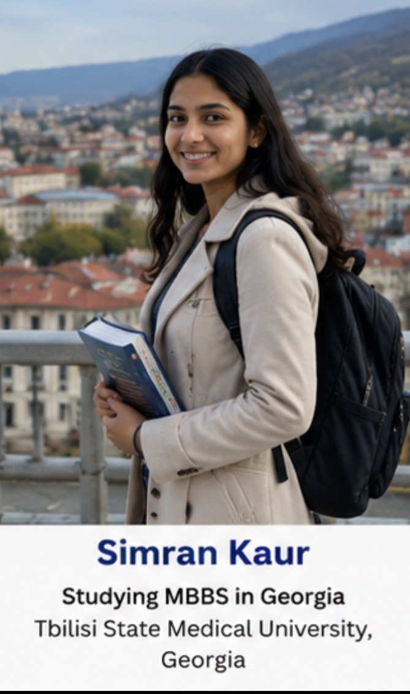
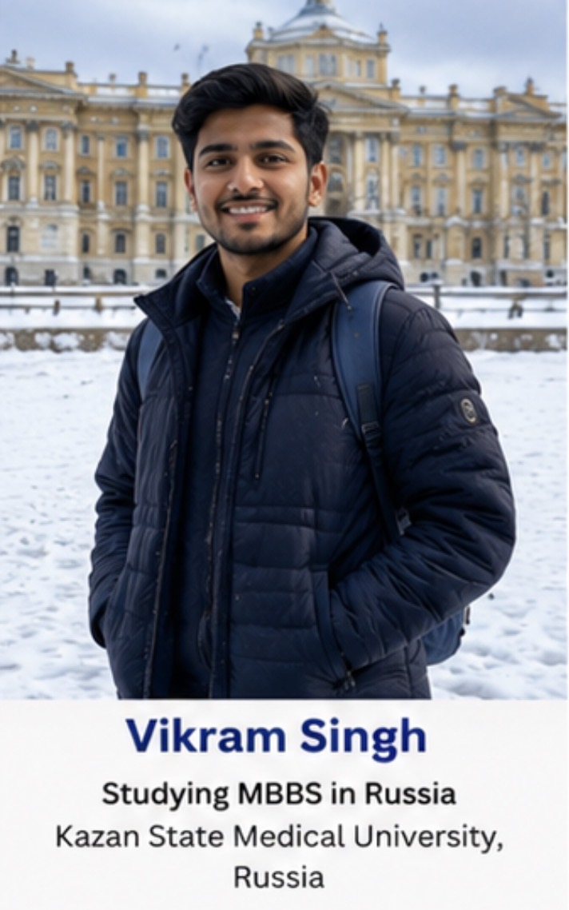
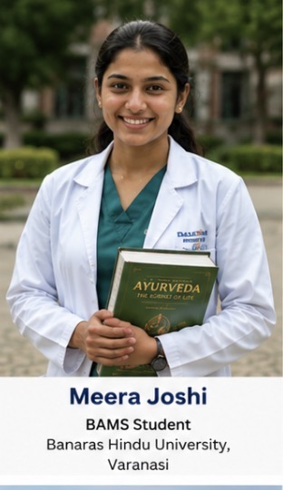
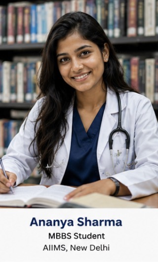

<h1 style="font-family:'Times New Roman',serif;font-size:48px;color:#0A3D91;margin-bottom:0;">
MedOrbit Foundation
</h1>

<h3 style="font-family:'Times New Roman',serif;color:#F39C12;margin-top:5px;">
Your Future. Our Mission.
</h3>

<b>Professional Education Consultancy • Career Guidance • Admissions • Jobs • Study Abroad</b>

---

# 🌍 Welcome to MedOrbit Foundation

<b style="font-family:'Times New Roman',serif;font-size:18px;">

MedOrbit Foundation is a modern education and career guidance organization committed to helping students achieve academic excellence and professional success.

We specialize in admissions across India and abroad, career counselling, recruitment assistance, scholarship guidance, visa support, higher education planning, and skill development.

Our objective is to provide transparent, ethical, and technology-driven consultancy services that empower students to build successful careers.

</b>

---

# 🎯 Why MedOrbit?

<table>

<tr>

<td width="50%">

✅ Student First Approach

✅ Transparent Counselling

✅ Experienced Guidance

✅ Admission Planning

✅ Scholarship Support

✅ Career Roadmaps

</td>

<td width="50%">

✅ Study Abroad

✅ Visa Assistance

✅ Job Assistance

✅ AI Counselling

✅ Documentation Support

✅ Lifetime Guidance

</td>

</tr>

</table>

---

# 🌎 Countries We Serve

<table>

<tr>

<td align="center">🇮🇳 <b>India</b></td>

<td align="center">🇳🇵 <b>Nepal</b></td>

<td align="center">🇷🇺 <b>Russia</b></td>

<td align="center">🇬🇪 <b>Georgia</b></td>

<td align="center">🇰🇿 <b>Kazakhstan</b></td>

</tr>

<tr>

<td align="center">🇺🇿 <b>Uzbekistan</b></td>

<td align="center">🇰🇬 <b>Kyrgyzstan</b></td>

<td align="center">🇵🇭 <b>Philippines</b></td>

<td align="center">🇦🇲 <b>Armenia</b></td>

<td align="center">🇪🇬 <b>Egypt</b></td>

</tr>

<tr>

<td align="center">🇬🇧 <b>United Kingdom</b></td>

<td align="center">🇺🇸 <b>USA</b></td>

<td align="center">🇨🇦 <b>Canada</b></td>

<td align="center">🇦🇺 <b>Australia</b></td>

<td align="center">🌍 <b>Europe</b></td>

</tr>

</table>

---

# 🚀 Our Core Services

| 🎓 Education | 💼 Careers | 🌎 Abroad |
|--------------|------------|-----------|
| MBBS | Career Counselling | Study Abroad |
| BDS | Recruitment | Visa Guidance |
| BAMS | Resume Building | Documentation |
| BHMS | Interview Preparation | Scholarships |
| Nursing | Skill Development | University Selection |
| Pharmacy | Placement Assistance | Education Loans |

---

# ⭐ Student Success

<table>

<tr>

<td align="center">

 

<b>Simran Kaur</b>

 

MBBS • Georgia

</td>

<td align="center">

 

<b>Vikram Singh</b>

 

MBBS • Russia

</td>

</tr>

<tr>

<td align="center">

 

<b>Ananya Sharma</b>

 

MBBS • India

</td>

<td align="center">

 

<b>Karan Malhotra</b>

 

MBBS • Kazakhstan

</td>

</tr>

</table>

---

<h1 style="font-family:'Times New Roman',serif;color:#0A3D91;">
🏆 Why Choose MedOrbit Foundation?
</h1>

<i>
Empowering students with trusted guidance, global opportunities, and lifelong career support.
</i>

 

<table>

<tr>

<td width="33%" align="center">

## 🎓

### Admissions

MBBS

BDS

BAMS

BHMS

Engineering

MBA

Law

Pharmacy

Nursing

Study Abroad

</td>

<td width="33%" align="center">

## 🌍

### Global Reach

India

Russia

Georgia

Nepal

Kazakhstan

Uzbekistan

Kyrgyzstan

Bangladesh

Philippines

Armenia

</td>

<td width="33%" align="center">

## 💼

### Career Services

Career Counselling

Documentation

Visa Guidance

Job Assistance

Resume Building

Interview Preparation

Scholarships

Skill Development

AI Guidance

</td>

</tr>

</table>

---

# 📊 MedOrbit At A Glance

| 🌟 Achievement | Description |
|:---:|:---|
| 🎓 | Medical Admissions Across India & Abroad |
| 🌍 | Global University Guidance |
| 💼 | Career & Placement Support |
| 📑 | Complete Admission Documentation |
| 🤖 | AI Assisted Counselling |
| 📱 | Fully Responsive Website |
| 🚀 | SEO Optimized Platform |
| 🏆 | Student-Centric Consultancy |

---

# 🎯 Our Core Values

| 💙 Transparency | 🤝 Trust | 🌍 Global Reach | 🚀 Innovation |
|:---:|:---:|:---:|:---:|
| Honest Guidance | Long-Term Support | Worldwide Universities | AI Driven Solutions |

---

# 🌟 What Makes Us Different?

✅ Personalized Counselling

✅ End-to-End Admission Support

✅ Career Roadmap Planning

✅ Country & University Comparison

✅ Genuine Scholarship Guidance

✅ Modern AI Assistance

✅ Responsive Digital Platform

✅ Continuous Student Support

✅ Professional Recruitment Services

✅ Ethical Consultancy Practices

---

# 📈 Our Vision

> **To become India's most trusted education and career guidance platform by empowering students with genuine opportunities, transparent counselling, and world-class educational solutions.**

---

# 🚀 Our Mission

✔ Guide every student with honesty.

✔ Simplify complex admission procedures.

✔ Connect students with globally recognized institutions.

✔ Build successful careers through professional mentorship.

✔ Deliver technology-driven educational solutions.

---

# ⭐ Excellence • Integrity • Innovation • Commitment

<!-- =========================================================
PART 3 — STUDENT SUCCESS + VISUAL SHOWCASE
========================================================= -->

<h1 style="font-family:'Times New Roman',serif;color:#0A3D91;">
🎓 Student Success Stories
</h1>

Real journeys. Real opportunities. Real achievements.

 

<table>
<tr>

<td width="50%" align="center" valign="top">

 

<h3>Simran Kaur</h3>

<b>MBBS Student • Georgia</b>

Tbilisi State Medical University

MedOrbit assisted with university selection, documentation, admission planning and pre-departure guidance.

</td>

<td width="50%" align="center" valign="top">

 

<h3>Karan Malhotra</h3>

<b>MBBS Student • Kazakhstan</b>

Asfendiyarov Kazakh National Medical University

The counselling process helped him compare suitable universities according to eligibility, academic goals and budget.

</td>

</tr>

<tr>

<td width="50%" align="center" valign="top">

 

<h3>Vikram Singh</h3>

<b>MBBS Student • Russia</b>

Kazan State Medical University

MedOrbit provided structured guidance for admission, documentation and overseas education planning.

</td>

<td width="50%" align="center" valign="top">

 

<h3>Ananya Sharma</h3>

<b>MBBS Student • India</b>

Medical Education Guidance

She received support for counselling, college comparison, documentation and admission planning.

</td>

</tr>
</table>

 

---

<h1 style="font-family:'Times New Roman',serif;color:#0A3D91;">
🌍 Explore Education Without Boundaries
</h1>

Guidance for students planning higher education in India and leading international destinations.

<table>

<tr>

<td align="center">🇮🇳 <b>India</b></td>
<td align="center">🇳🇵 <b>Nepal</b></td>
<td align="center">🇷🇺 <b>Russia</b></td>
<td align="center">🇬🇪 <b>Georgia</b></td>
<td align="center">🇰🇿 <b>Kazakhstan</b></td>

</tr>

<tr>

<td align="center">🇺🇿 <b>Uzbekistan</b></td>
<td align="center">🇰🇬 <b>Kyrgyzstan</b></td>
<td align="center">🇧🇩 <b>Bangladesh</b></td>
<td align="center">🇦🇲 <b>Armenia</b></td>
<td align="center">🇵🇭 <b>Philippines</b></td>

</tr>

<tr>

<td align="center">🇬🇧 <b>United Kingdom</b></td>
<td align="center">🇺🇸 <b>United States</b></td>
<td align="center">🇨🇦 <b>Canada</b></td>
<td align="center">🇦🇺 <b>Australia</b></td>
<td align="center">🇪🇺 <b>Europe</b></td>

</tr>

</table>

---

<h1 style="font-family:'Times New Roman',serif;color:#0A3D91;">
💼 Management and MBA Guidance
</h1>

Support for college selection, specialisation planning, entrance preparation and career pathways.

<table>

<tr>

<td width="50%" valign="top">

### 🎓 MBA Admissions

- College and university comparison
- CAT, XAT, MAT, CMAT and other entrance guidance
- Application planning
- Profile evaluation
- Interview preparation
- Documentation assistance
- Scholarship information
- Education loan guidance

</td>

<td width="50%" valign="top">

### 📊 MBA Specialisations

- Finance
- Marketing
- Human Resources
- Business Analytics
- International Business
- Operations
- Healthcare Management
- Information Technology
- Entrepreneurship
- Supply Chain Management

</td>

</tr>

</table>

---

<h1 style="font-family:'Times New Roman',serif;color:#0A3D91;">
🏥 Medical and Healthcare Education
</h1>

<table>

<tr>

<td align="center">
<h3>🩺 MBBS</h3>
India and Abroad
</td>

<td align="center">
<h3>🦷 BDS</h3>
Dental Education
</td>

<td align="center">
<h3>🌿 AYUSH</h3>
BAMS • BHMS • BUMS
</td>

<td align="center">
<h3>💊 Pharmacy</h3>
B.Pharm • D.Pharm • Pharm.D
</td>

</tr>

<tr>

<td align="center">
<h3>👩‍⚕️ Nursing</h3>
GNM • ANM • B.Sc Nursing
</td>

<td align="center">
<h3>🧪 Paramedical</h3>
Allied Health Programs
</td>

<td align="center">
<h3>🦴 Physiotherapy</h3>
BPT • MPT
</td>

<td align="center">
<h3>🔬 Diagnostics</h3>
Laboratory and Imaging Courses
</td>

</tr>

</table>

---

<h1 style="font-family:'Times New Roman',serif;color:#0A3D91;">
💡 MedOrbit Bright Ideas and AI Feedback Hub
</h1>

A future-ready space where students can ask questions, share ideas, report problems and receive intelligent assistance.

<table>

<tr>

<td width="50%" valign="top">

### Students Can Submit

- Admission questions
- College suggestions
- Scholarship queries
- Website feedback
- Career questions
- Feature requests
- Error reports
- Job-related enquiries

</td>

<td width="50%" valign="top">

### AI-Assisted Support

- Instant general responses
- Relevant page suggestions
- Course and country direction
- Human counsellor escalation
- Enquiry categorisation
- Feedback tracking
- WhatsApp support handoff
- Future ticket generation

</td>

</tr>

</table>

---

<h1 style="font-family:'Times New Roman',serif;color:#0A3D91;">
📱 Built for Every Device
</h1>

<table>

<tr>

<td align="center">📱 <b>Mobile</b> Android and iPhone</td>

<td align="center">📲 <b>Tablet</b> iPad and Android</td>

<td align="center">💻 <b>Laptop</b> Windows and macOS</td>

<td align="center">🖥️ <b>Desktop</b> Standard and Wide Screens</td>

</tr>

</table>

### Development Requirement

Every MedOrbit page must be:

- Mobile-first and fully responsive
- Compatible with Android, iPhone, tablets, laptops and desktops
- Accessible through Chrome, Safari, Firefox and Edge
- Built using semantic HTML5
- Optimised for performance and search engines
- Free from overlapping, broken or overflowing elements
- Designed with readable typography and touch-friendly controls
- Tested at common mobile, tablet and desktop breakpoints

---

### Next Section

**Project Features • Technology Stack • Project Structure • Roadmap • Contact Information**

<h2>🎬 MedOrbit Campus Showcase</h2>

# 🩺 MedOrbit Foundation

### <b>Your Future. Our Mission.</b>

<h3>
Professional Education Consultancy • Career Guidance • Admissions • Study Abroad • Jobs • Training
</h3>

 

  

---

# 🌍 Welcome to MedOrbit Foundation

MedOrbit Foundation is a modern education and career guidance platform that helps students and professionals make informed decisions about their future.

We provide guidance for admissions in **India and abroad**, career planning, scholarships, recruitment, documentation support, visa guidance, and professional training through a transparent, student-focused approach.

Our objective is to simplify every step of the educational journey while helping students connect with trusted institutions and genuine opportunities.

---

# 📚 Quick Navigation

| Section | Description |
|---------|-------------|
| 🎓 Services | Education, admissions, jobs & training |
| 🌍 Countries | Study destinations we support |
| ⭐ Student Success | Testimonials and journeys |
| 💼 Career Guidance | MBA, Engineering, Medical & more |
| 🖥 Website Features | Platform capabilities |
| 📂 Project Structure | Repository organization |
| 🛠 Technology | HTML, CSS, JavaScript |
| 🚀 Roadmap | Future development |
| 📞 Contact | MedOrbit Foundation |

---

# 🎯 Why Choose MedOrbit?

<table>

<tr>

<td align="center" width="25%">

### 🎓

### Education

Admissions across India and international universities.

</td>

<td align="center" width="25%">

### 🌎

### Global Reach

Multiple countries and recognized institutions.

</td>

<td align="center" width="25%">

### 💼

### Careers

Career counselling and recruitment guidance.

</td>

<td align="center" width="25%">

### 🤝

### Student Support

Transparent assistance from enquiry to admission.

</td>

</tr>

</table>

---

# ✨ Our Core Services

| 🎓 Education | 🌍 Abroad | 💼 Careers | 📄 Support |
|--------------|-----------|-----------|-----------|
| MBBS | Study Abroad | Career Counselling | Documentation |
| BDS | Visa Guidance | Recruitment | Scholarships |
| AYUSH | University Selection | Interview Guidance | Admission Planning |
| Nursing | Hostel Guidance | Resume Support | Student Assistance |
| Pharmacy | Travel Guidance | Professional Training | Counselling |

---

## ⭐ "Guiding Students. Building Careers. Creating Opportunities."

---
